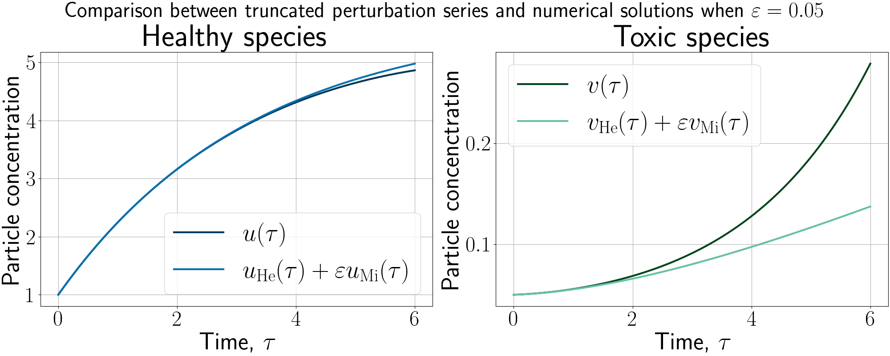
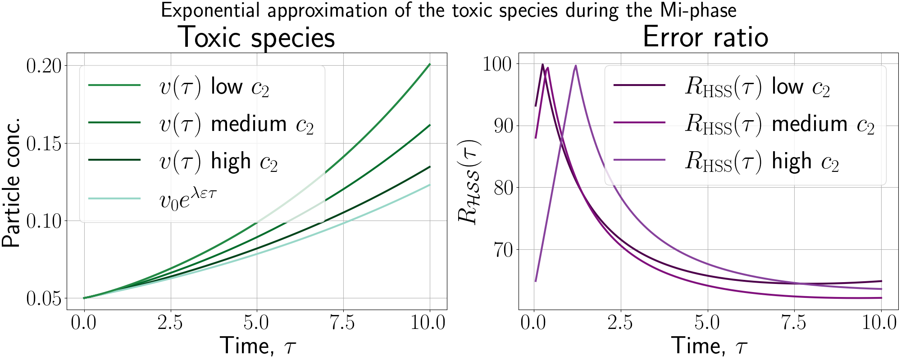

# Analytical approximations in the HeMi-phases of the solutions to the heterodimer model
*Written by:* Johannes Borgqvist, 
*Date:* 2026-10-02. 

This is the github-repositry associated with the manuscript entitled "*Analytical characterisation of the Mi- and To-phases in HeMiTo dynamics: exponential growth and logistic saturation of toxic prion-like proteins*". Here, we solve the system of heterodimer models numerically and then compare it to truncated perturbation series as well as an exponential approximation for the toxic species. The Python-script which generates the figures is called ``*HeMiTo.py*'' which is stored in the Code-folder and the figures are stored in the Figures-folder.

The two figures below correspond to FIG. 2 and FIG. 3 in the manuscript. 

