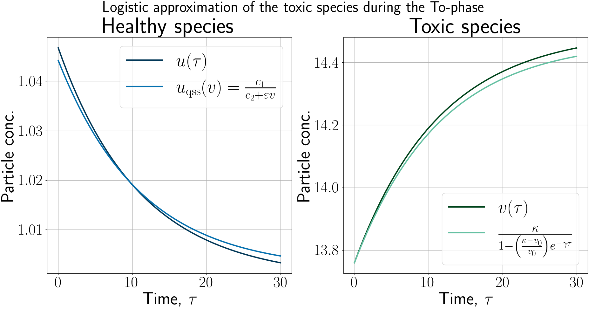

# Analytical approximations in the HeMi-phases of the solutions to the heterodimer model
*Written by:* Johannes Borgqvist, 
*Date:* 2026-10-09. 

This is the github-repositry associated with the manuscript entitled "*Analytical characterisation of the Mi- and To-phases in HeMiTo dynamics: exponential growth and logistic saturation of toxic prion-like proteins*". Here, we solve the system of heterodimer models numerically in order to achieve three things. First, we compare the numerical solutions for the early dynamics, i.e. during the He- and Mi-phases, to their truncated perturbation series. Second, we compare the exponential approximation of the toxic species during the Mi-phase to numerical solutions and we quantify the numerical error. Third, we compare the logistic approximation for the toxic species and the nullcline approximation for the healthy species during the late To-phase. The Python-script which generates the figures is called ``*HeMiTo.py*'' which is stored in the Code-folder and the figures are stored in the Figures-folder.

The three figures below correspond to FIG. 2, FIG. 3 and FIG. 4 in the manuscript. 

